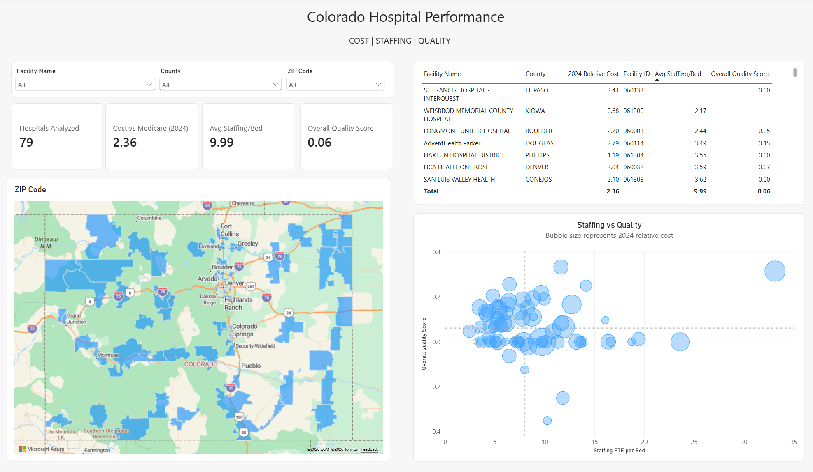

# Colorado Hospital Performance Analysis

## Project Overview

This Power BI project analyzes Colorado hospitals across three areas of performance: patient outcomes, staffing, and relative procedure costs. The goal is to make publicly available healthcare data easier to compare and explore at the individual hospital level.

## Dashboard

The interactive Power BI report allows users to compare Colorado hospitals by facility and geographic area and explore relationships among hospital quality, staffing, and relative procedure costs.

## Business Questions

- How do Colorado hospitals compare on patient outcomes and quality measures?
- How do staffing levels vary among hospitals?
- How do relative procedure costs compare across facilities?
- Are there visible relationships between staffing, quality, and cost?

## Tools & Skills

- Power BI
- Power Query
- DAX
- Data Cleaning and Transformation
- Data Modeling
- Data Visualization
- Healthcare Analytics

## Analysis & Findings

This report is designed primarily as an exploratory comparison tool rather than a causal analysis. It allows users to compare hospitals across quality, staffing, and relative cost measures and identify facilities that may warrant further investigation.

### Key Observations

- Hospital performance varies meaningfully across quality, staffing, and cost measures.
- Higher staffing levels do not automatically correspond to higher quality scores, suggesting that staffing should be interpreted alongside other operational and clinical factors.
- Relative procedure costs vary substantially across hospitals, even within the same geographic market.
- Some hospitals perform relatively well on quality measures while maintaining lower relative costs, making them useful candidates for further benchmarking.
- Facility, county and zip code level filters make it easier to compare individual hospitals and investigate outliers.
- The data did not allow inpatient vs outpatient costs to be analyzed separately. This would be a useful addition if the data becomes available.

### Interpretation

The dashboard is intended to support comparison and hypothesis generation. It does not establish that staffing levels or costs directly cause differences in patient outcomes. Differences among hospitals may also reflect patient populations, service mix, hospital size, case complexity, and other factors not included in the analysis.

## Project Files

### Power BI Report

[Download the Power BI project file (.pbix)](Colorado_Hospital_Performance.pbix)

The PBIX file contains the complete report, including the data model, Power Query transformations, DAX measures, and report visualizations.

**Requirements:** Microsoft Power BI Desktop is required to open the PBIX file.## Data Sources

## Sources

This project combines publicly available hospital quality, staffing, facility, and cost data from federal and Colorado health care data sources.

### Centers for Medicare & Medicaid Services (CMS) — Provider Data Catalog

Hospital quality and facility data were obtained from the CMS Provider Data Catalog. CMS publishes hospital-level data used by Medicare Care Compare for evaluating the quality of care provided by Medicare-certified hospitals.

[CMS Hospital Data — Provider Data Catalog](https://data.cms.gov/provider-data/topics/hospitals)

Datasets used in this analysis include:

- **Hospital General Information** — hospital name, location, facility characteristics, and overall hospital quality information.
- **Complications and Deaths** — hospital-level measures related to complications and mortality.
- **Healthcare-Associated Infections** — measures of infections such as CLABSI, CAUTI, C. difficile, MRSA, and surgical-site infections.
- **Unplanned Hospital Visits** — measures related to hospital readmissions and other unplanned return visits.

CMS hospital quality measures are derived from sources including Medicare claims, hospital reporting systems, and CDC's National Healthcare Safety Network (NHSN).

### Center for Improving Value in Health Care (CIVHC)

Relative procedure cost information was obtained from the Center for Improving Value in Health Care (CIVHC), administrator of the Colorado All Payer Claims Database (CO APCD).

[CIVHC Public Data](https://civhc.org/get-data/public-data/)

CIVHC's public data tools provide information derived from Colorado health insurance claims and allow comparisons of health care prices and quality across hospitals and other facilities.

The relative cost data in this project were used to compare procedure costs across Colorado hospitals rather than represent specific patient charges.

### Geographic Scope

The analysis is limited to Colorado hospitals. Facility identifiers and hospital names were cleaned and matched across the source datasets to create a common hospital dimension for analysis in Power BI.

